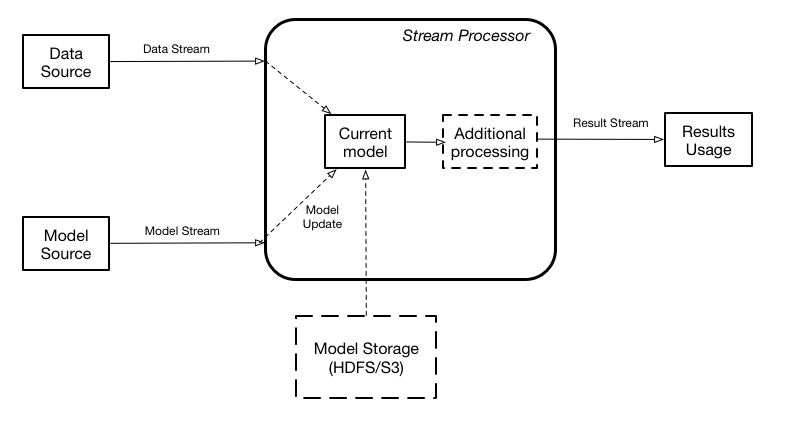
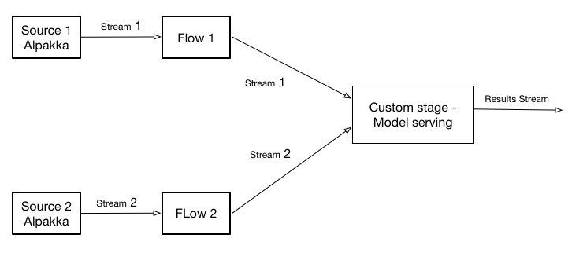
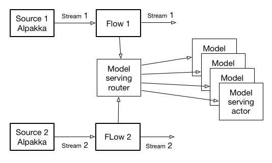
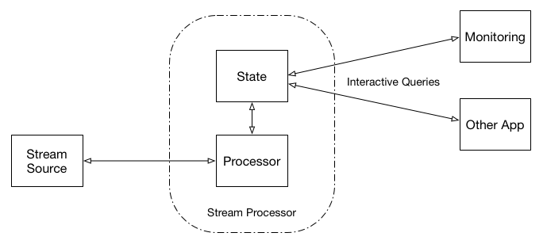

# Model serving Akka Streams and Kafka Streams

# Overall Architecture

A high level view of the overall model serving architecture (
similar to [dynamically controlled stream](https://data-artisans.com/blog/bettercloud-dynamic-alerting-apache-flink)) 

This architecture assumes two data streams - one containing data that needs to be scored, and one containing the model updates. The streaming engine contains the current model used for the actual scoring in memory. The results of scoring can be either delivered to the customer or used by the streaming engine internally as a new stream - input for additional calculations. If there is no model currently defined, the input data is dropped. When the new model is received, it is instantiated in memory, and when instantiation is complete, scoring is switched to a new model. The model stream can either contain the binary blob of the data itself or the reference to the model data stored externally (pass by reference) in a database or a filesystem, like HDFS or S3. 
Such approach effectively using model scoring as a new type of functional transformation, that can be used by any other stream functional transformations.
Although the overall architecture above is showing a single model, a single streaming engine could score multiple models simultaneously. 

# Akka Streams

There are two implementations based on the Akka Streams (both Scala and Java):
* Implementation based on the usage of a custom stage, which is a fully type-safe way to encapsulate required functionality. 
The stage implements stream processor functionality from the overall architecture diagram. 
With such component in place, the overall implementation is going to look as follows:

* Implementation based on the actors and [router pattern](http://michalplachta.com/2016/01/23/scalability-using-sharding-from-akka-cluster/)
In this case the stream processor functionality is implemented by an individual Model serving actor,
while Model serving manager serves as a router passing execution for a given data type to a specific actor.
Additionally this implementation is using a simple "local file" persistence ensuring restartability of the application.
The overall implementation looks like follows:

# Kafka Streams

The project contains three versions of Kafka Stream implementation (both Scala and Java):
* Naive - implementation based on internal memory and [Process Topology](https://kafka.apache.org/10/documentation/streams/developer-guide#streams_processor_topology)
* Usage of standard store - implementation based on Kafka Streams key/value Store and Kafka Streams [DSL](https://kafka.apache.org/10/documentation/streams/developer-guide#streams_dsl)
* Usage of a custom store - implementation based on a Custom Store and Kafka Streams [DSL](https://kafka.apache.org/10/documentation/streams/developer-guide#streams_dsl)

Referr to [discussion](http://mkuthan.github.io/) on differences between Process Topology and DSL

Scala implementation is based on Scala support for Kafka streams (project scalakafkastreamwrapper) allowing to use Fluent Kafka
Streams APIs (similar to Java fluent APIs) in Scala

# Queryable state

Kafka Streams  recently [introduced](https://docs.confluent.io/current/streams/developer-guide.html#id8) queryable state, which is 
a nice approach to execution monitoring.
This feature allows to treat the stream processing layer as a 
lightweight embedded database and, more concretely, to directly query the latest state of your stream processing application, without needing to materialize that state to external databases or external storage first.

Both Akka Streams and Kafka streams implementation support queryable state.
Akka Streams and Java version of the Kafka Streams queryable APIs are based on [Akka HTTP](https://doc.akka.io/docs/akka-http/current/scala/http/)

# Scaling

Both Akka and Kafka Streams implementations are in JVM implementations.
If the source of streams is Kafka, they both can be deployed as a cluster.
Fig below shows Kafka Streams cluster. Akka Streams implementation can be scaled the same way

# Prerequisites

Overall implement relies on Kafka (current version is 1.0) and leverages embedded Kafka servers (client project).
It uses 2 queues:
* `models_data` - queue used for sending data
* `models_models` - queue used for sending models
Model provider and data provider applications check if their corresponding queues exist. Run them 
first if not sure whether queues exist

# Build the code

We recommend using [IntelliJ IDEA](https://www.jetbrains.com/idea/) for managing and building the code. The project is organized as several modules:

* `data` - some data files for running the applications
* `images` - diagrams used for this document
* `akkaserverpersistent` - Akka Streams implementation of model serving (based router and actors)
* `akkaserver` - Akka Streams implementation of model serving (based on custom stage)
* `client` - Data and model loader used to run either Akka or Kafka streams application. 
This process has to be started first to ensure that Kafka local server is running.
* `configuration` - Shared configurations anf InfluxDB support (see prerequisites)
* `model` - Implementation of both Tensorflow anf PMML models.
* `protobufs` - Shared models in protobuf format.
* `naiveserver` -  Kafka Streams implementation of model serving using in memory storage.
* `serverstandardstore` -  Kafka Streams implementation of model serving using standard data store.
* `server` -  Kafka Streams implementation of model serving using custom data store.
* `scalakafkastreamingwrapper` -  Scala implementation of Kafka streams DSL.

The build is done via SBT

    cd KafkaStreamsModelServer
    sbt compile
    # For IntelliJ users, just import a project and use IntelliJ commands

# Deploy and Run

This project contains many executables:
* `akkaserver` - Custom stage based Akka Streams implementation of model serving (both Scala and Java)
* `akkaserverpersistent` - Custom actor based Akka Streams implementation of model serving (both Scala and Java)
* `naivekafkaserver` - Kafka Streams implementation of model serving using in memory store (both Scala and Java)
* `standardstorekafkaserver`- Kafka Streams implementation of model serving using key/value store (both Scala and Java)
* `customstorekafkaserver` - Kafka Streams implementation of model serving using custom store (both Scala and Java)
* `dataprovider` - Data and model publisher. This executable contains embedded kakfka server and has to be started 
first to ensure that Kafka is running.

Each application can run either locally (on user's machine) or on the server.

## Running locally

Running locally can be done either using SBT or Intellij 

To query `akkaserver` state connect your browser to `host:5500/stats` to get statistics of the current execution
Currently `akkaserver` supports only statistics for a given server. If a cluster is used, each server needs to be
queried (with the same port)

To query `kafkaserver` state connect your browser to `host:8888`. This contains several URLs:
* `/state/instances` returns the list of instances containing a store Naive implementation does not support this one. 
* `/state/value` returns current state of the model serving

